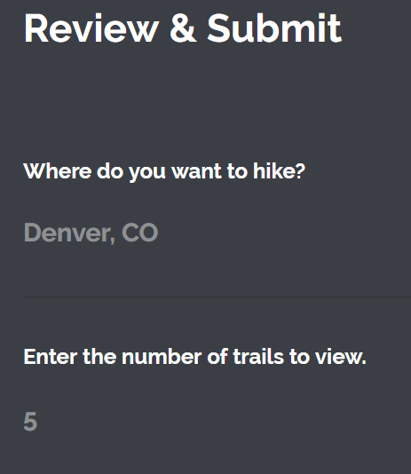
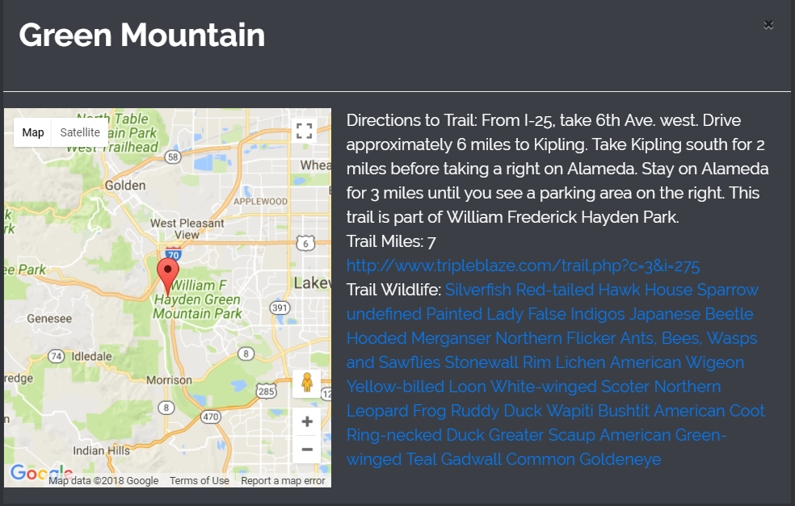

# Hike Safely

In this application, the user enters a location and a number of trails to view to find hiking trails in the area. Buttons with available trail names are displayed, and the user can click a button to view more information about the hiking trail. 

This information includes:
- A map of with a pin showing the location of the hiking trail.
- Directions to the trail.
- The trail distance in miles.
- A link to a website with more information about the trail.
- A listing of wildlife, including plants and animals, that exists near the trail.

# Development Motivation

Our team has nature lovers. We developed this application to enhance the trail experience for hikers by providing them information about the plants and animals near their hiking trail.

We also added practical information that hikers would want to know, such as the trail mileage and a link to the trail website.

# Application Screenshots

# Tools Used
- Trail API (for trail information)
- iNaturalist API (for wildlife information)
- Google Maps API (for maps)
- Bootstrap 
- css
- JavaScript
- jQuery
- Ajax libary
- Firebase
